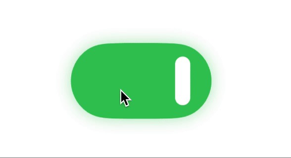

# AnimatedToggle

Provides a stunning animated toggle in SwiftUI.



## Requirements
* iOS 15.0+
* Xcode 15

## Installation

### Swift Package Manager

Add the following dependency to your `Package.swift` file:

```swift
dependencies: [
    .package(url: "https://github.com/aisenurmor/AnimatedToggle.git", from: "1.0.0")
]
```
And then import wherever needed: **import AnimatedToggle**

## Usage

```swift
AnimatedToggle(
    isOn: isOn,
    settings: .init(height: height),
    onTapAction: { isOn in
                   
    }
)
```

|  Attribute  |  Purpose  |   Type    |  Default  |
| :------------| :---- | :----:  | :----: |
| isOn        | You can set initial value of the toggle  | Bool      | false |
| settings    | You can set height of the toggle  | Settings  | height: 50 |
| onTapAction | You can handle when the status of the toggle changes  | Closure  |  |

Also, If you would like to change shadow and background colors of the toggle, please call the *.editing(on:_,off:_)* method as follows: 

```swift
AnimatedToggle(
    isOn: isOn,
    settings: .init(height: height),
    onTapAction: { isOn in
                   
    }
)
.editing(
    on: .init(
        backgroundColor: Color, shadowColor: Color
    ),
    off: .init(
        backgroundColor: Color, shadowColor: Color
    )
)
```

## License

MIT License

Copyright (c) 2023 aisenurmor

Permission is hereby granted, free of charge, to any person obtaining a copy
of this software and associated documentation files (the "Software"), to deal
in the Software without restriction, including without limitation the rights
to use, copy, modify, merge, publish, distribute, sublicense, and/or sell
copies of the Software, and to permit persons to whom the Software is
furnished to do so, subject to the following conditions:

The above copyright notice and this permission notice shall be included in all
copies or substantial portions of the Software.

THE SOFTWARE IS PROVIDED "AS IS", WITHOUT WARRANTY OF ANY KIND, EXPRESS OR
IMPLIED, INCLUDING BUT NOT LIMITED TO THE WARRANTIES OF MERCHANTABILITY,
FITNESS FOR A PARTICULAR PURPOSE AND NONINFRINGEMENT. IN NO EVENT SHALL THE
AUTHORS OR COPYRIGHT HOLDERS BE LIABLE FOR ANY CLAIM, DAMAGES OR OTHER
LIABILITY, WHETHER IN AN ACTION OF CONTRACT, TORT OR OTHERWISE, ARISING FROM,
OUT OF OR IN CONNECTION WITH THE SOFTWARE OR THE USE OR OTHER DEALINGS IN THE
SOFTWARE.
